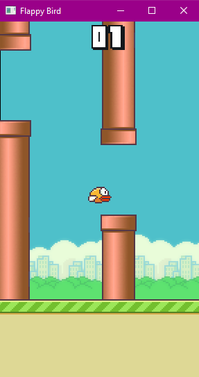

# flappy-bird-OpenGL


<div align="center" >

</div>

  - [Description](#description)
- [Downloading the game](#downloading-the-game)
  - [Cloning the repository](#cloning-the-repository)
  - [Downloading the files as a zip](#downloading-the-files-as-a-zip)
- [Installation](#installation)
- [Running the game](#running-the-game)
- [Playing the game](#playing-the-game)
- [Support](#support)
- [Screenshots](#screenshots)
- [Built With](#built-with)
- [Author](#author)
- [License](#license)

## Description
Flappy Bird OpenGL
This project is a recreation of Flappy Bird using the PyOpenGL library which provides access to the OpenGL (Open Graphics Library) API. This game is a recreation of the popular mobile game where the player controls a bird and tries to fly between pipes without hitting them. The game is built using Python 3 and PyOpenGL library. The game is intended to be played in PCs that is running Linux or Windows.

## Downloading the game

You can download the game files by cloning or downloading this repository.

### Cloning the repository

1. Make sure you have Git installed on your system.
2. Open the command line and navigate to the directory where you want to clone the repository.
3. Run the following command:

```bash
git clone https://github.com/tameemalaa/flappy-bird-OpenGL.git
```

This will create a new directory called `flappy-bird-OpenGL` in your current directory and download all the game files into it.

### Downloading the files as a zip

1. Go to the GitHub repository page by clicking [here](https://github.com/tameemalaa/flappy-bird-OpenGL).
2. Click the "Code" button and then select "Download ZIP"
3. Extract the downloaded zip file to a directory on your local machine

## Installation

To run this game, you will need to have Python 3 and the necessary packages installed on your system. You can install the required packages by running the following command:

#### For Linux

```bash
python3 -m pip install -r requirements.txt
```

#### For Windows

```bash
python -m pip install -r requirements.txt
```
#### Notes

- For some versions of python the official `PyOpenGL` and `PyOpenGL_accelerate`  packages don't work properly. if you have trouble installing them you can use this [guide](https://www.youtube.com/watch?v=a4NVQC_2S2U&t=344s&ab_channel=NaseemShah).

- I don't recommend using `python 3.11` with this project since it's not yet fully compatible with most dependencies such as `pygame`.

- If you have further problem installing the dependencies feel free to [contact me](mailto:tameem.alaa@gmail.com).

## Running the game

To start the game, navigate to the directory where you have the game files and run the following command:

#### For Linux

```bash
python3 main.py
```

#### For Windows

```bash
python main.py
```

## Playing the game

The objective of the game is to navigate the bird through the pipes without hitting them. Use the spacebar key to make the bird jump. The game keeps track of your score, which is the number of pipes you have successfully passed through.

## Support

For any issues or support, please open a GitHub issue or contact me through [e-mail](mailto:tameem.alaa@gmail.com).

## Screenshots

<div align="center" ></div>

## Built With

- **Python3**
- **PyOpenGL**
- **Playsound** *To read play audio*  
- **Pygame** *To read textures from disk*  

## Author

Tameem Bakr

## License

This project is licensed under the MIT license.
